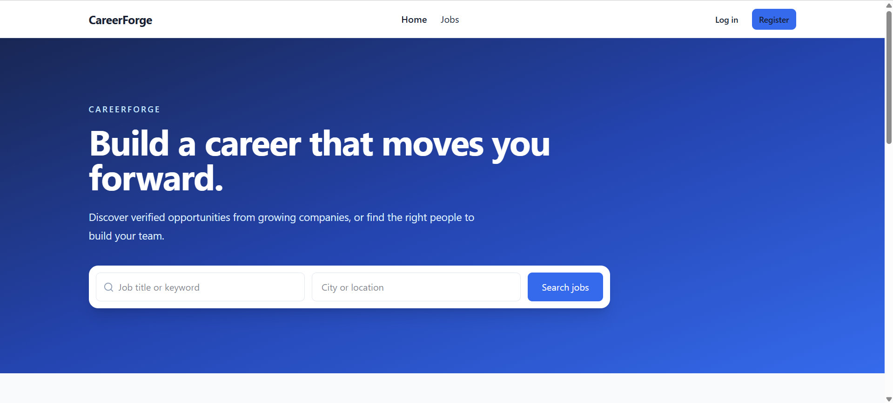
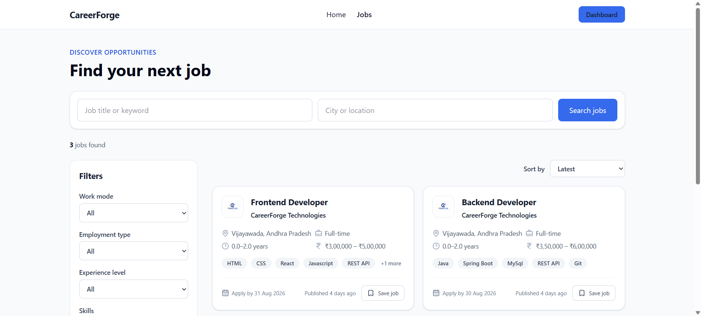
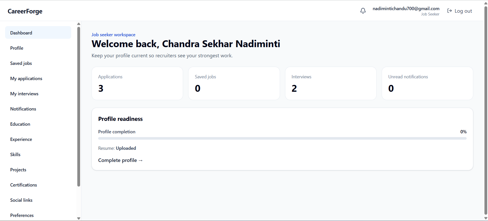
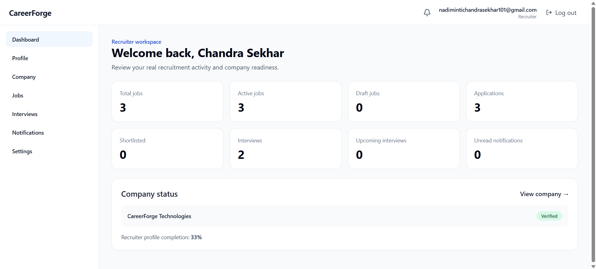
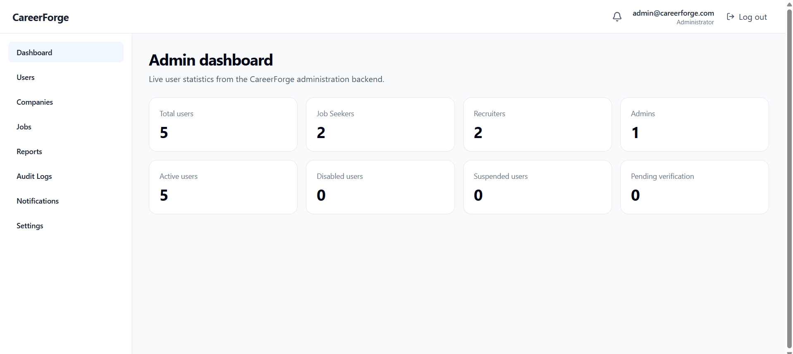

# CareerForge

CareerForge is a production-ready **Job Recruitment and Application Management System** designed to support the complete recruitment lifecycle for public visitors, job seekers, recruiters, and administrators.

The platform provides secure authentication, role-based access control, public job discovery, company and job management, saved jobs, applications, interview scheduling and management, notifications, file uploads, reporting, moderation, audit logging, and administrative workflows.

---

## Live Application

### Frontend

CareerForge frontend is deployed on **Vercel**.

**Production URL:**

```text
https://job-recruitment-and-application-man.vercel.app
```

### Backend

CareerForge backend is deployed on **Render**.

**Production Base URL:**

```text
https://job-recruitment-and-application.onrender.com
```

**Health Endpoint:**

```text
https://job-recruitment-and-application.onrender.com/api/health
```

**Readiness Endpoint:**

```text
https://job-recruitment-and-application.onrender.com/api/health/ready
```

---

## Repository Structure

```text
Job-Recruitment-And-Application-Management-System/
├── .github/
│   └── workflows/
├── client/
│   ├── src/
│   ├── README.md
│   └── vercel.json
├── server/
│   ├── src/
│   └── README.md
└── README.md
```

### Frontend

The complete React/Vite frontend is located in:

```text
client/
```

Frontend-specific documentation is available in:

```text
client/README.md
```

### Backend

The complete Node.js/Express backend is located in:

```text
server/
```

Backend-specific documentation is available in:

```text
server/README.md
```

Additional backend technical and API documentation is maintained under:

```text
server/src/docs/
```

### CI/CD

GitHub Actions workflows are maintained under:

```text
.github/workflows/
```

---

## User Roles

CareerForge supports four major user groups.

### Public Visitor

Public visitors can:

* Browse available jobs
* Search jobs
* Filter and sort job listings
* Use pagination
* View job details
* View company information
* View similar jobs

### Job Seeker

Job seekers can:

* Register an account
* Verify their email address
* Resend verification emails
* Log in securely
* Restore authenticated sessions
* Manage profile information
* Upload and manage profile images
* Upload and manage resumes/documents
* Configure job preferences
* Save and unsave jobs
* Apply for jobs
* View applications
* Track application status
* View application history
* Withdraw eligible applications
* View interviews
* View interview details
* Confirm interview attendance
* Decline interviews
* Manage interview rescheduling
* Receive notifications
* Manage account sessions
* Change password
* Change email
* Log out
* Log out from all sessions

### Recruiter

Recruiters can:

* Access a recruiter dashboard
* Manage recruiter profile information
* Create and manage companies
* Submit companies for verification
* Create jobs
* Edit jobs
* Publish jobs
* Close jobs
* Manage recruiter job listings
* Review applicants
* View applicant details
* View applicant resumes
* Maintain recruiter notes
* Update application statuses
* Schedule interviews
* Reschedule interviews
* Manage interview history
* Receive recruitment-related notifications

### Administrator

Administrators can:

* Access the administrator dashboard
* Manage users
* View user details
* Enable users
* Disable users
* Moderate jobs
* Remove jobs
* Restore jobs
* Manage reports
* Review report details
* Verify companies
* Reject companies
* Review audit logs
* View audit-log details
* Perform administrative moderation actions

---

## Technology Stack

### Frontend

* React
* Vite
* React Router
* Axios
* Tailwind CSS
* Lucide React
* Sonner
* date-fns
* Vitest
* React Testing Library
* ESLint

### Backend

* Node.js
* Express
* Sequelize
* MySQL
* JWT authentication
* HTTP-only refresh-token cookies
* bcrypt
* Express Validator
* CORS
* Multer
* Cloudinary
* Brevo Transactional Email API
* Jest
* Supertest
* ESLint

### Infrastructure and Deployment

* Git
* GitHub
* GitHub Actions
* Vercel
* Render
* MySQL
* Cloudinary
* Brevo

---

## High-Level Architecture

```text
Browser
   |
   v
React / Vite Frontend
   |
   v
Axios
   |
   v
Express REST API
   |
   v
Controllers / Services
   |
   v
Repositories / Sequelize
   |
   v
MySQL
```

External integrations:

```text
CareerForge Backend
├── Cloudinary
│   └── File and image storage
│
└── Brevo
    └── Transactional email delivery
```

The frontend and backend are deployed independently and communicate through the production REST API.

---

## Core Functional Areas

### Authentication and Account Management

CareerForge provides a complete authentication and session lifecycle:

* Registration
* Email verification
* Verification resend
* Login
* JWT access-token authentication
* Refresh-token session handling
* Session restoration
* Logout
* Logout from all sessions
* Session management
* Session revocation
* Forgot password
* Reset password
* Change password
* Email change
* Protected frontend routes
* Role-based authorization

### Public Job Discovery

* Job listings
* Search
* Filtering
* Sorting
* Pagination
* Job details
* Company details
* Similar jobs

### Job-Seeker Workflows

* Dashboard
* Profile management
* Profile image management
* Resume/document management
* Job preferences
* Saved jobs
* Applications
* Application details
* Application tracking
* Application timeline/history
* Application withdrawal
* Interview management
* Interview attendance confirmation
* Interview decline
* Interview rescheduling
* Notifications

### Recruiter Workflows

* Dashboard
* Recruiter profile
* Company management
* Company verification workflow
* Job creation
* Job editing
* Job publishing
* Job closing
* Applicant management
* Applicant details
* Resume viewing
* Recruiter notes
* Application status management
* Interview scheduling
* Interview rescheduling
* Interview management/history

### Administrator Workflows

* Dashboard
* User management
* User details
* User enable/disable actions
* Job moderation
* Job removal/restoration
* Report management
* Report actions
* Company verification/rejection
* Audit logs
* Audit-log details
* Moderation validation

## Application Screenshots

### Home Page



### Public Job Discovery



### Job Seeker Dashboard



### Recruiter Dashboard



### Administrator Dashboard



---

## Authentication and Security

CareerForge includes security-focused implementation across the frontend and backend.

Security features include:

* Password hashing
* JWT-based access authentication
* HTTP-only refresh-token cookies
* Secure production cookies
* Role-based authorization
* Backend ownership validation
* Protected frontend routes
* Trusted-origin validation
* CORS protection
* Input validation
* Session management
* Session revocation
* Environment-based secrets
* Administrative audit logging
* Production-safe error handling

Refresh tokens are stored in secure HTTP-only cookies and are not manually stored in frontend `localStorage` or `sessionStorage`.

Production credentials, passwords, API keys, tokens, database credentials, and private secrets must never be committed to the repository.

---

## Frontend

The frontend application is located in:

```text
client/
```

The frontend is fully implemented and integrated with the CareerForge backend REST API.

Frontend documentation:

```text
client/README.md
```

---

## Backend

The backend application is located in:

```text
server/
```

For backend-specific installation, environment configuration, database migrations, testing, API documentation, and technical details, see:

```text
server/README.md
```

---

## Local Development

### Prerequisites

Ensure the required local development environment is available:

* Node.js
* npm
* MySQL
* Git

External services must also be configured when testing functionality that depends on them.

---

## Clone the Repository

```bash
git clone https://github.com/chandu7000/Job-Recruitment-And-Application-Management-System.git
```

Enter the repository:

```bash
cd "Job-Recruitment-And-Application-Management-System"
```

---

## Backend Setup

Enter the backend directory:

```bash
cd server
```

Install dependencies:

```bash
npm ci
```

Use the backend environment template:

```text
server/.env.example
```

Configure the required local environment variables and database connection.

Run the required database migrations.

Start the backend development server:

```bash
npm run dev
```

For complete backend setup information, see:

```text
server/README.md
```

---

## Frontend Setup

From the repository root:

```bash
cd client
```

Install dependencies:

```bash
npm ci
```

Use the frontend environment template:

```text
client/.env.example
```

Start the frontend development server:

```bash
npm run dev
```

---

## Environment Configuration

Environment-specific configuration must remain outside source control.

Secret-free templates:

```text
client/.env.example
server/.env.example
```

### Frontend Environment

The frontend uses:

```text
VITE_API_BASE_URL
```

to configure the CareerForge API base URL.

### Backend Environment

Backend environment variable names and configuration requirements are documented through:

```text
server/.env.example
```

and:

```text
server/src/docs/ENVIRONMENT_VARIABLES.md
```

Real passwords, JWT secrets, database credentials, API keys, Cloudinary credentials, Brevo credentials, and other private configuration must never be committed to Git.

---

## Frontend Commands

Run frontend commands from:

```text
client/
```

### Development

```bash
npm run dev
```

### ESLint

```bash
npm run lint
```

### Automated Tests

```bash
npm test
```

### Production Build

```bash
npm run build
```

---

## Backend Commands

Run backend commands from:

```text
server/
```

### Development

```bash
npm run dev
```

### Automated Tests

```bash
npm test
```

### ESLint

```bash
npm run lint
```

Database migration and seed commands are available through the backend package scripts.

---

## Automated Testing

CareerForge contains comprehensive frontend and backend automated test suites.

### Frontend Quality Gate

Established frontend verification:

```text
59/59 test files passed
225/225 tests passed
ESLint passed
Production Vite build passed
```

### Backend Quality Gate

Established backend verification:

```text
107/107 test suites passed
1326/1326 tests passed
ESLint passed
```

Testing covers areas including:

* Authentication
* Authorization
* Session behavior
* Routing
* Route guards
* Public jobs
* Job-seeker workflows
* Recruiter workflows
* Administrator workflows
* Applications
* Saved jobs
* Interviews
* Notifications
* Validation
* API integration
* Business rules
* Security behavior
* Administrative moderation

---

## Continuous Integration

CareerForge uses GitHub Actions for continuous integration.

Frontend CI workflow:

```text
.github/workflows/frontend-ci.yml
```

The frontend CI pipeline performs:

```text
Dependency Installation
        |
        v
ESLint
        |
        v
Automated Tests
        |
        v
Production Build
```

Frontend CI runs for:

* Pushes to `main`
* Pull requests targeting `main`

The repository also contains backend CI validation.

A healthy frontend GitHub Actions run has been successfully verified against the stable `main` branch.

---

## Production Deployment

### Frontend Deployment

Platform:

**Vercel**

Production URL:

```text
https://job-recruitment-and-application-man.vercel.app
```

The Vercel Production environment tracks:

```text
main
```

Frontend production configuration uses:

```text
VITE_API_BASE_URL
```

SPA routing is configured through:

```text
client/vercel.json
```

This allows direct browser navigation and refreshes on frontend application routes.

### Backend Deployment

Platform:

**Render**

Production URL:

```text
https://job-recruitment-and-application.onrender.com
```

Production backend configuration includes:

* MySQL connectivity
* Approved frontend-origin CORS handling
* HTTPS
* Secure authentication cookies
* Cloudinary integration
* Brevo transactional email
* Production logging
* Health checks
* Readiness checks

---

## Production Verification

The deployed CareerForge application has been manually verified across important production workflows.

Verification includes:

* Frontend loading
* Frontend/backend communication
* SPA route refresh
* CORS
* HTTPS
* Secure refresh cookies
* `SameSite=None`
* Session restoration
* Login
* Logout
* Role-based access
* Invalid credential handling
* Profile image upload
* Resume upload
* Resume preview/download
* Upload persistence
* Transactional email
* Public jobs
* Search
* Filters
* Pagination
* Job details
* Company information
* Saved jobs
* Applications
* Duplicate-application handling
* Application tracking
* Application withdrawal
* Interview scheduling
* Candidate interview actions
* Interview rescheduling
* Interview history
* Recruiter workflows
* Notifications
* Administrative moderation
* Error handling
* Responsive UI
* Multi-tab session isolation verified for simultaneous Admin, Recruiter, and Job Seeker sessions in the same browser

---

## API Documentation

Backend API and technical documentation is maintained under:

```text
server/src/docs/
```

Important documents include:

* `API.md`
* `API_CONTRACT.md`
* `ARCHITECTURE.md`
* `ENDPOINT_INVENTORY.md`
* `ENVIRONMENT_VARIABLES.md`
* `FRONTEND_API_HANDOFF.md`
* `MODEL_INVENTORY.md`
* `PRODUCTION_CONFIGURATION.md`
* `TEST-DATA-STRATEGY.md`
* `TESTING.md`

## API Handover

CareerForge does not maintain a separate Postman collection as the primary API handover artifact.

The backend API handover is maintained through the repository's version-controlled documentation:

```text
server/src/docs/API.md
server/src/docs/API_CONTRACT.md
server/src/docs/ENDPOINT_INVENTORY.md
server/src/docs/FRONTEND_API_HANDOFF.md
server/src/docs/ENVIRONMENT_VARIABLES.md

---

## API Contract

The CareerForge backend API contract is established and integrated with the production frontend.

Frontend functionality follows the existing backend:

* Routes
* Request formats
* Response formats
* Authentication requirements
* Authorization rules
* Pagination behavior
* Business rules

Established backend contracts should not be changed unnecessarily.

---

## File Storage

CareerForge uses **Cloudinary** for applicable file and image storage.

This includes functionality such as:

* Profile images
* Resumes/documents

Cloudinary credentials are maintained through secure environment configuration.

---

## Transactional Email

CareerForge uses **Brevo** for transactional email functionality.

Email-related authentication and account workflows use the configured Brevo integration.

Brevo credentials remain outside source control.

---

## CI/CD Flow

The stable production branch is:

```text
main
```

High-level delivery flow:

```text
Development
     |
     v
Git Commit
     |
     v
GitHub
     |
     v
GitHub Actions
     |
     v
Validated main
     |
     +-------------------+
     |                   |
     v                   v
   Vercel              Render
  Frontend             Backend
```

---

## Documentation

Project documentation is maintained across:

```text
README.md
client/README.md
server/README.md
server/src/docs/
```

These resources provide project-level, frontend, backend, API, architecture, environment, testing, security, and production documentation.

---

## Known Non-Blocking Limitation

The current frontend production build may report a Vite warning that the primary JavaScript bundle exceeds **500 kB after minification**.

This is currently considered a performance optimization opportunity rather than a functional or deployment blocker.

---

## Future Improvements

The following improvements are optional future enhancements and are not required for the completed CareerForge application:

- Frontend bundle splitting and lazy-loading optimization
- Additional accessibility auditing
- End-to-end browser automation
- Expanded production monitoring and observability
- Additional performance optimization
- Expanded reporting and analytics
- Automated visual-regression testing
- Further UI/UX refinements based on user feedback

These improvements are intentionally separate from the completed project requirements and do not represent current functional or deployment blockers.

## Project Status

* Backend implementation — Complete
* Frontend implementation — Complete
* Authentication and authorization — Complete
* Public job discovery — Complete
* Job-seeker workflows — Complete
* Recruiter workflows — Complete
* Administrator workflows — Complete
* Company management — Complete
* Job management — Complete
* Applications and saved jobs — Complete
* Interview management — Complete
* Notifications — Complete
* Reporting and moderation — Complete
* File uploads — Complete
* Transactional email — Complete
* Frontend automated testing — Complete
* Backend automated testing — Complete
* Frontend production build — Complete
* Frontend production deployment — Complete
* Backend production deployment — Complete
* Production frontend/backend integration — Complete
* Frontend CI/CD — Complete
* Backend CI/CD — Complete
* API contract — Frozen
* Final documentation — Complete
* Final handover — Complete

---

## Production URLs

### Frontend

```text
https://job-recruitment-and-application-man.vercel.app
```

### Backend

```text
https://job-recruitment-and-application.onrender.com
```

### Backend Health

```text
https://job-recruitment-and-application.onrender.com/api/health
```

### Backend Readiness

```text
https://job-recruitment-and-application.onrender.com/api/health/ready
```

---

## Security Notice

Never commit:

* Production passwords
* Database credentials
* JWT secrets
* Cloudinary credentials
* Brevo credentials
* Private API keys
* Access tokens
* Refresh tokens
* Other sensitive production configuration

Use the provided `.env.example` files as secret-free configuration references and maintain real values through secure local or deployment-platform environment settings.
